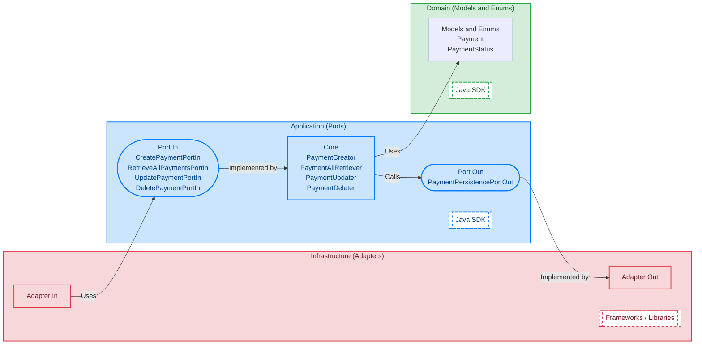

# Ports And Adapters Reference

## Overview

Reference project for **Ports And Adapters** architecture, implementing the hypothetical **Payment** domain.

---

### Domain

The domain includes the following model and enum:

#### Payment

- Payer Reference
- Payee Reference
- Payment Amount
- Payment Subject
- Execution Date

#### Payment Status

- PENDING
- COMPLETED
- FAILED

---

### Application

The application includes the following ports in:

- CreatePaymentPortIn
- RetrieveAllPaymentsPortIn
- UpdatePaymentPortIn
- DeletePaymentPortIn

---

## Diagrams

