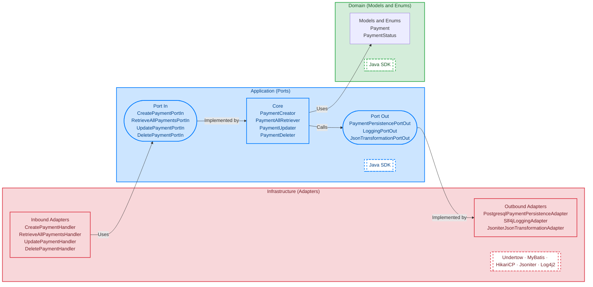

# Ports And Adapters Reference - Undertow PostgreSQL

## Overview

Infrastructure module implementing the **inbound** (Undertow REST) and **outbound** (PostgreSQL/MyBatis) adapters for the `ports-and-adapters-reference-core`. It exposes a CRUD API for the `Payment` domain.

| Method   | Path                      | Handler                      |
|----------|---------------------------|------------------------------|
| `GET`    | `/api/v1/ping`            | `ResponseCodeHandler.HANDLE_200` |
| `POST`   | `/api/v1/payments`        | `CreatePaymentHandler`       |
| `GET`    | `/api/v1/payments`        | `RetrieveAllPaymentsHandler` |
| `PUT`    | `/api/v1/payments/{a0}`   | `UpdatePaymentHandler`       |
| `DELETE` | `/api/v1/payments/{a0}`   | `DeletePaymentHandler`       |

---

## Diagrams

### Infrastructure



---

## Structure

```
src/main/java/net/coatli/reference/portsandadapters/
└── infrastructure/
    ├── adapter/
    │   ├── in/
    │   │   └── rest/undertow/
    │   │       ├── CreatePaymentHandler.java
    │   │       ├── RetrieveAllPaymentsHandler.java
    │   │       ├── UpdatePaymentHandler.java
    │   │       ├── DeletePaymentHandler.java
    │   │       ├── config/
    │   │       │   ├── ExceptionConfig.java
    │   │       │   └── RoutesConfig.java
    │   │       └── model/
    │   │           ├── CreatePaymentRequest.java
    │   │           ├── UpdatePaymentRequest.java
    │   │           ├── RetrieveAllPaymentsResponse.java
    │   │           ├── RetrieveAllPaymentsItemResponse.java
    │   │           └── mapper/
    │   │               ├── CreatePaymentHandlerMapper.java
    │   │               ├── RetrieveAllPaymentsHandlerMapper.java
    │   │               ├── UpdatePaymentHandlerMapper.java
    │   │               └── DeletePaymentHandlerMapper.java
    │   └── out/
    │       ├── logging/slf4j/
    │       │   └── Slf4jLoggingAdapter.java
    │       ├── persistence/postgresql/
    │       │   ├── PostgresqlPaymentPersistenceAdapter.java
    │       │   └── mybatis/
    │       │       ├── MyBatisPaymentMapper.java
    │       │       └── model/
    │       │           ├── PaymentRow.java
    │       │           └── mapper/
    │       │               └── PostgresqlPaymentPersistenceMapper.java
    │       └── transformation/jsoniter/
    │           └── JsoniterJsonTransformationAdapter.java
    └── bootstrap/
        ├── ApplicationProperties.java
        ├── PaymentBootstrap.java
        └── di/
            ├── ApplicationCoreModule.java
            ├── InfrastructureAdapterInModule.java
            └── InfrastructureAdapterOutModule.java
```

---

## Build

### Requirements

- [Docker](https://docs.docker.com/engine/install/)

### Run

```shell
docker run \
  --rm \
  -w $(pwd) \
  -v $(pwd)/..:$(pwd)/.. \
  -v $(pwd):$(pwd) \
  -v ${HOME}/.m2:/root/.m2 \
  -v /var/run/docker.sock:/var/run/docker.sock \
  azul/zulu-openjdk-alpine:25.0.3 \
  ./mvnw -Djansi.force=true -ntp -P local -U clean verify
```
